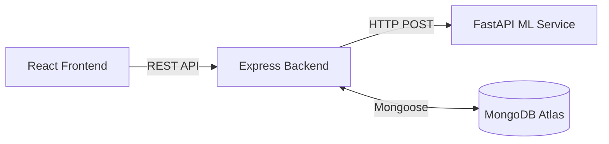

# MediPredict - AI Disease Prediction System


MediPredict is a comprehensive, microservices-based healthcare application that utilizes Machine Learning to predict potential diseases based on patient symptoms. It offers a secure authenticated dashboard, dynamic PDF reports, and instant lifestyle recommendations.

## Features
- **AI-Powered Predictions**: Select from 130+ symptoms to get accurate disease predictions.
- **Microservices Architecture**: Completely decoupled Python ML backend and Node.js REST API.
- **Comprehensive Reports**: Get disease descriptions, precautions, medications, diets, and workouts.
- **Downloadable PDFs**: Automatically generate printable diagnostic reports.
- **Secure Authentication**: JWT-based user authentication and protected routes.

## Tech Stack
- **Frontend**: React, Vite, Tailwind CSS, Lucide Icons
- **Backend (API)**: Express.js, Node.js, Mongoose
- **Backend (ML)**: FastAPI, Python, Scikit-Learn, Pandas
- **Database**: MongoDB Atlas

## Architecture Diagram


## Folder Structure
- `/client` - React frontend application.
- `/server` - Node.js Express API.
- `/ml-service` - Python FastAPI machine learning service.

## Installation & Local Development

### 1. Start the ML Service
```bash
cd ml-service
python -m venv venv  or  py -3.12 -m venv venv 
source venv/bin/activate  # On Windows: venv\Scripts\activate
pip install -r requirements.txt
uvicorn app.main:app --reload --port 8000
```

### 2. Start the Express Server
```bash
cd server
npm install or npm i --force
# Create a .env file based on .env.example
npm run dev
```

### 3. Start the React Client
```bash
cd client
npm install or npm i --force
# Create a .env file based on .env.example
npm run dev
```

## Environment Variables
Refer to the `.env.example` files in each respective directory. (rename or make .env file) 

## Deployment
See [DEPLOYMENT.md](./DEPLOYMENT.md) for full instructions on how to deploy this stack to Vercel and MongoDB Atlas.

## Future Improvements
- Expand the ML dataset to cover more obscure diseases.
- Integrate third-party email services for password resets.
- Add real-time doctor consultation scheduling.

## License
MIT License.

## Author
Built with ❤️ for the health-tech community.
